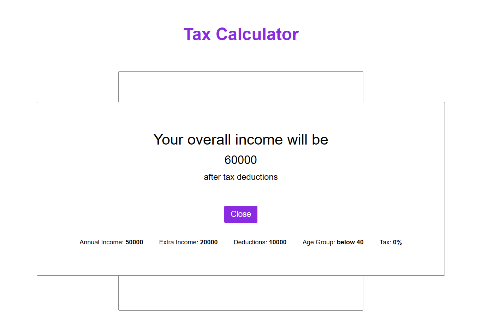
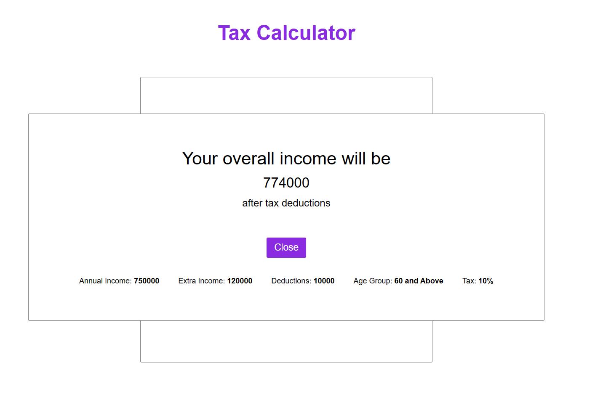

# Tax Calculator

## Design a website that allows for tax calculation based on a users input.

- The code sets up a tax calculator interface using HTML, CSS, and JavaScript, including fields for annual income, extra income, age group selection, and deductions, along with error handling for input validation.
- It utilizes event listeners for user interaction, such as displaying hint messages and validating user input for numerical values only. Additionally, it calculates tax deductions based on income and age group, displaying the results dynamically on submission.

_Note:- This project was deployed netfliy_

**Live Link**: [Link](https://tax-calculator-gouthamv.netlify.app/)

### Project Working/Images:

UI: 

Erros and Hint: 
 

 

Working: 
Empty Field Submit 
 

Invalid Input Submit 
 

Valid Input Submit 
 

Test Cases : 
Below 8Lakhs 
 
 

Above 8Lakhs & Age<40 
 
 

Above 8Lakhs & Age>=40 & <60 
 
 

Above 8Lakhs & Age>=60 
 
 
